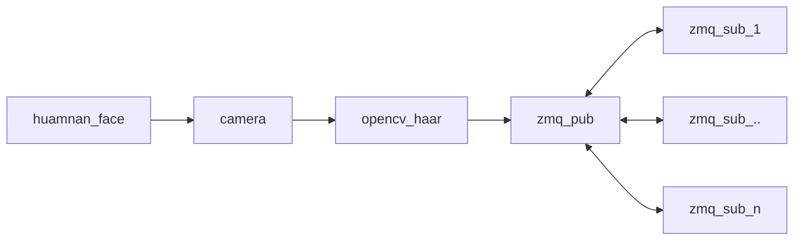

# Face Detectin Demo

## build FaceDetector and demo client with opencv haar and libzmq

1. build opencv from souce code
2. edit opencv/CMakeLists.txt set OpenCV_DIR to your hosts (`set(OpenCV_DIR C:/Users/lzbgt/work/github.com/opencv/build/install/x64/vc16/lib)`)
3. build

```
./build.sh opencv
```

build artifacts: install/FaceDetector.exe, install/ClientDemo.exe

### run

FaceDetector.exe [--show]

```
--show: openup live camera GUI anchored with detected face regions
```

## communication model



## zmq protocol spec

pub/sub model with json payload:

```json
{"event": str =  "face_on|face_off", cnt:int = NUM_OF_FACES_IN_VISION}
```

## 3rd-party library and references

[1] opencv

[2] libzmq

[3] [zmq via CSharp](https://www.codeproject.com/Articles/488207/ZeroMQ-via-Csharp-Introduction "https://www.codeproject.com/Articles/488207/ZeroMQ-via-Csharp-Introduction")
